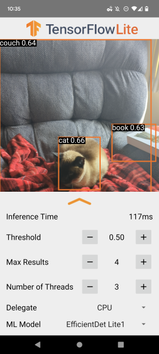

# Drishti (दृष्टि) - A Computer Vision based Android Application for Visually Impaired People

Drishti (a Sanskrit word for "vision") is an Android application that acts as a real-time visual assistant for people with vision impairments. It uses on-device machine learning to identify objects through the phone's camera and communicates what it "sees" to the user through audio and haptic feedback.

## Key Features

-   **Real-Time Object Detection**: Identifies multiple objects simultaneously from a live camera feed.
-   **Auditory Feedback**: Announces the names of detected objects out loud using Text-to-Speech, specifically configured for the Hindi language.
-   **Haptic Feedback**: Vibrates the device upon successful detection to provide physical confirmation.
-   **On-Device Processing**: All AI processing happens locally on the device; no internet connection is required.
-   **Advanced User Controls**: Provides a detailed settings panel to fine-tune the detection model's parameters, including:
    -   Confidence Threshold
    -   Maximum number of results
    -   CPU/GPU/NNAPI hardware delegation
    -   Ability to switch between different ML models.

## How It Works

The application uses Android's CameraX library to stream frames to a TensorFlow Lite object detection model. For each frame, the model identifies objects and returns a list of results. The application then loops through these results, speaking the name of each object and vibrating the phone, with a short delay between each announcement to ensure a clear user experience. The results are also drawn as bounding boxes on the screen for sighted users.

## Technology Stack

-   **Language**: [Kotlin](https://kotlinlang.org/)
-   **Platform**: [Android](https://www.android.com/)
-   **Machine Learning**: [TensorFlow Lite](https://www.tensorflow.org/lite) (via the Task Library)
-   **Camera**: [CameraX](https://developer.android.com/training/camerax)
-   **UI**: Android Fragments, View Binding

## Building the Project

This is a standard Android Gradle project.

1.  Clone the repository.
2.  Open the project in Android Studio.
3.  Let Gradle sync and download the required dependencies.
4.  Build and run the application on an Android device or emulator.

## Project Status

This application is a functional proof-of-concept. The core object detection feature is implemented in `CameraFragment1`. The main user interface (`MainActivity`) has been structured to support a multi-feature tabbed layout ("Explore", "Read", "Find", "Scan", "Detect"), but the core logic has not yet been migrated into this new structure.
